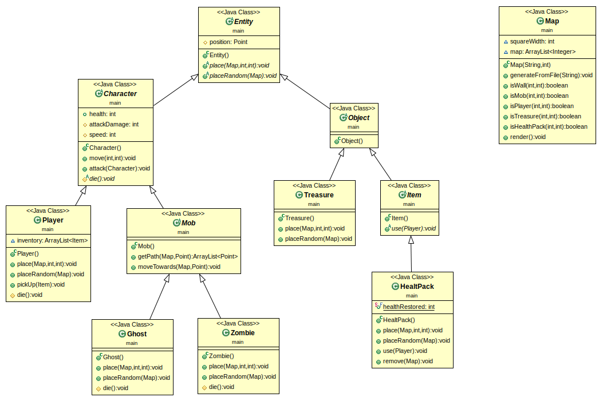
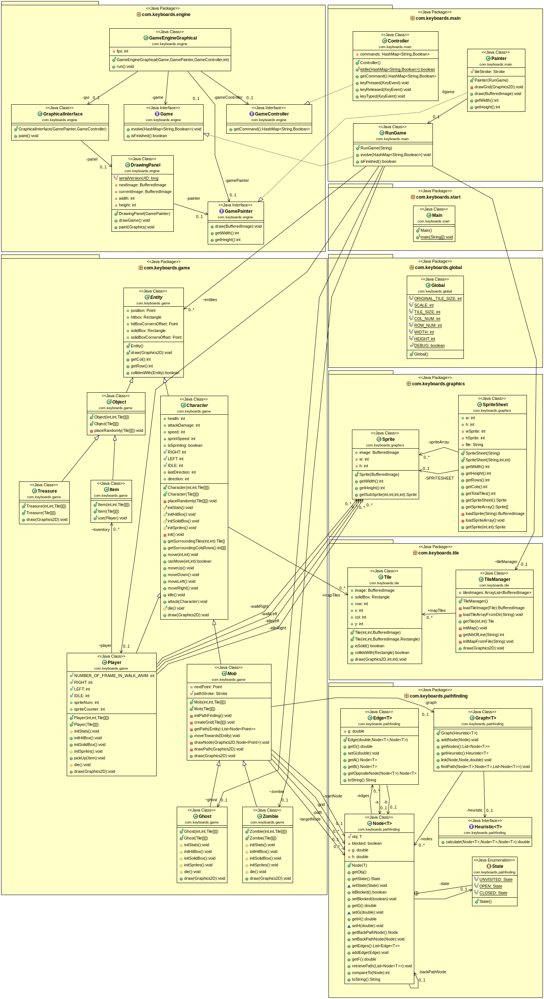

# Backlog 1 début

**Fonctionnalités pour le sprint 1 :**

- Mouvement + placement personnage
- Génération Labyrinthe premier niveau à partir d’un fichier
- Monstres placement + déplacement vers joueur
- Placement objets (trésor, vie) et effets des objets
- Personnage perd vie au contact d’un monstre
- Nombre de vie limité

**Qui fait quoi :**

- Robin : Monstres placement + déplacement
- Elsa : Vie du perso
- Antoine : Objets
- Audrey : Labyrinthe
- Loric : Personnage déplacement + placement

## Diagramme de classes

&nbsp;
# Backlog 1 fin

## Sprint review

**Fonctionnalitées réellement réalisées pour le sprint 1:**

- Mouvement + placement personnage
- Génération Labyrinthe premier niveau à partir d’un fichier
- Monstres placement + déplacement vers joueur
- Frontières de la map infranchissables
- Personnage perd vie au contact d’un monstre
- Nombre de vie limité

## Sprint rétrospective

**Ce qu'il s'est passé :**

- Robin a travaillé sur les bases du projet donc répartition des tâches déséquilibrée
- Grande partie du code prévu réalisé mais pas push à temps
- Placement des objets non réalisé

**Decisions prises pour le sprint 2 :**

- Plus de reunions (discord ou en réel) pour mieux organiser le travail et les push
- Répartir les tâches plus uniformément

## Diagramme de classes final

