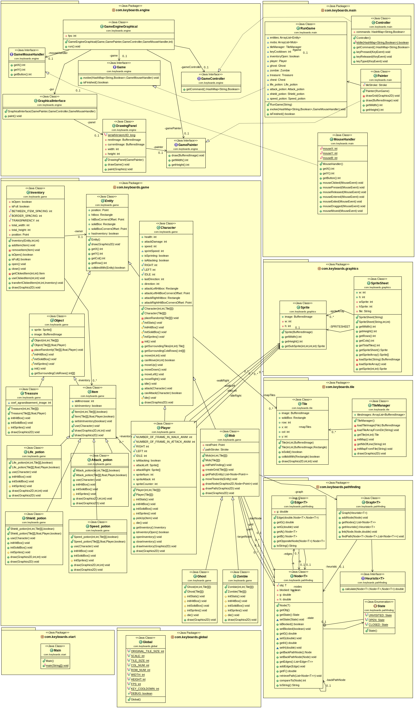
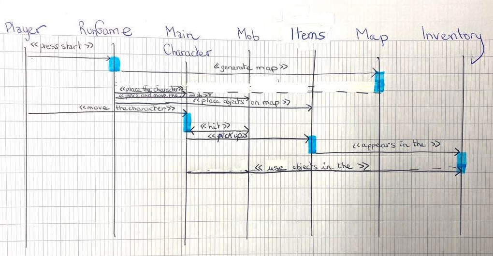

# Backlog 2 début

**Fonctionnalités pour le sprint 2 :**

- Placement objets (trésor, vie) et effets des objets
- Personnage qui attaque le monstre
- UI vie personnage
- Déplacement de la caméra avec le personnage
- Faire fichier map plus grand
- Gestion souris
- Inventaire

**Qui fait quoi :**

- Robin : Inventaire + gestion souris
- Elsa : UI vie personnage + déplacement de la caméra avec le personnage
- Antoine : Placement objets (trésor, vie) et effets des objets
- Audrey : Faire fichier map plus grand
- Loric : Personnage qui attaque le monstre

## Diagramme de classes

## Diagramme de sequence

